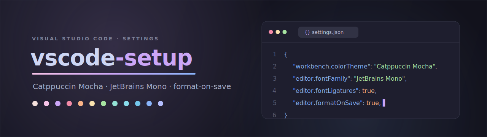

<p align="center">
  
</p>

<p align="center">
  
  
  
  
</p>

---

> My personal **VS Code** `settings.json` — a calm, low-contrast **Catppuccin Mocha** setup tuned for long coding sessions: ligatured **JetBrains Mono**, generous line-height, and formatting that just happens on save.

## ✨ Highlights

- 🎨 **Catppuccin Mocha** theme with custom workbench color tweaks + Material Icon Theme
- 🔤 **JetBrains Mono** with ligatures, 14px / 1.7 line-height, smooth caret animation
- 🧹 **Format on save** via Prettier, with ESLint auto-fix for JS/TS
- 📐 2-space indent, rulers at **80 / 120**, bracket-pair colorization, indent guides
- 🗂️ File nesting (lockfiles, `*.js` under `*.ts`, `.env.*` under `.env`, …)
- 🤫 Telemetry **off**, no release-notes popups, minimal chrome (compact menu bar, custom title)
- 💾 Auto-save on focus change, trim trailing whitespace, final newline

## 🚀 Install

Drop `settings.json` into your VS Code **user settings** location:

| OS | Path |
|----|------|
| macOS | `~/Library/Application Support/Code/User/settings.json` |
| Linux | `~/.config/Code/User/settings.json` |
| Windows | `%APPDATA%\Code\User\settings.json` |

```bash
# macOS example
curl -fsSL https://raw.githubusercontent.com/msverlovych/vscode-setup/main/settings.json \
  -o "$HOME/Library/Application Support/Code/User/settings.json"
```

## 🧩 Requires

For everything to render as intended, install these first:

- **Theme:** [Catppuccin for VSCode](https://marketplace.visualstudio.com/items?itemName=Catppuccin.catppuccin-vsc)
- **Icons:** [Material Icon Theme](https://marketplace.visualstudio.com/items?itemName=PKief.material-icon-theme)
- **Formatter:** [Prettier](https://marketplace.visualstudio.com/items?itemName=esbenp.prettier-vscode) · [ESLint](https://marketplace.visualstudio.com/items?itemName=dbaeumer.vscode-eslint)
- **Font:** [JetBrains Mono](https://www.jetbrains.com/lp/mono/)

---

<p align="center"><sub>🐱 Catppuccin Mocha · made for calm, focused coding.</sub></p>
